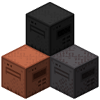

  

<h3 align="center">Iron Quarry</h3>

Destroying half of your world before finishing modpack progression!

## About

Programmed in [Java](https://github.com/openjdk/jdk), for [Fabric](https://fabricmc.net/blog/),
this mod enables you to destroy the world you live in while consuming excessive amounts of energy, so you can finally ask yourself how to satisfy your energy demands for the first time ever!

## Dependencies

* [Fabric API](https://github.com/FabricMC/fabric)
* [RebornCore](https://github.com/TechReborn/RebornCore)
